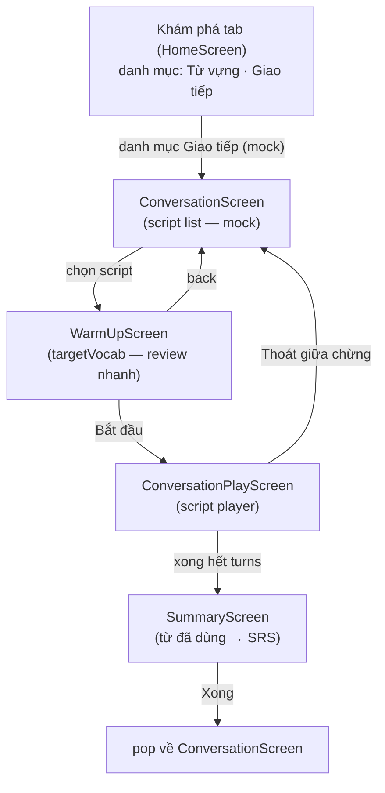

# Draft — Conversation script format + kịch bản mẫu

Trạng thái: **nháp — chờ duyệt**. Feature: luyện conversation (scripted, offline).
Nguồn script: **mock hiện tại → Firebase Storage sau này** (quyết định 2026-08-04).

## 1. Nguyên tắc

- Script là **dữ liệu nội dung**, không phải localization keys — chuỗi `text`/`textVi` nằm trong script,
  không đưa vào ARB. ARB chỉ giữ chuỗi chrome UI (nút, label).
- Định dạng **JSON** vì tương lai tải từ Firebase Storage (download raw JSON, parse).
- Word timing highlight KHÔNG lưu trong script — tính bằng pipeline TTS sherpa_onnx hiện có
  (`generate → silence detection → TtsWordRange`), script chỉ cung cấp text.
- User turn ở MVP là **chọn câu gợi ý** (không ASR). Mọi choice đều advance script (không branching ở MVP).
  Khi ASR vào (Phase 2), user nói tự do → transcript fuzzy-match với `choices` → dùng `targetWords` cho feedback.

## 1b. User flow (MVP)

Cấu trúc: tab **Khám phá** (`MainScaffold` tab 0 → `HomeScreen`) hiển thị **các danh mục nội dung**. Hiện tại có:
- **Từ vựng** — danh mục hiện có (topic catalog, Firebase)
- **Giao tiếp** — danh mục mới (conversation); **mock danh mục** ở MVP, catalogs (script từ Firebase) bổ sung sau

Entry: từ `HomeScreen` (tab Khám phá) → danh mục **Giao tiếp** → `ConversationScreen` (danh sách script). Cùng pattern `HomeScreen` hiện đã push `TopicListScreen` (vocabulary) qua `Navigator.push` — conversation cũng vậy, không đổi navigation cấp app, không thêm tab.



**Chi tiết từng bước:**

1. **Vào** — `HomeScreen` (tab Khám phá) hiển thị danh mục **Giao tiếp** (mock card — tĩnh, không cần catalog). Bấm vào → `ConversationScreen`: danh sách script (mock). Mỗi script hiển thị: title, difficulty, `estimatedMinutes`, `targetVocab` (để người dùng chọn theo từ mình đang cần ôn).
2. **Warm-up** — bấm vào script → `WarmUpScreen`: review nhanh `targetVocab` (term + `senseVi`) trước khi vào hội thoại. Nút "Bắt đầu".
3. **Play** — `ConversationPlayScreen`: script player (state machine trong `application/`, không nhét logic vào widget):
   - Turn `speaker: app` → TTS đọc `text` (pipeline sherpa_onnx) + highlight từ đang đọc. Hint: nút nghe lại, nút xem `textVi`.
   - Turn `speaker: user` → hiện `choices[]` (2–3 câu gợi ý) để bấm chọn. Chọn cái nào cũng advance script (MVP, không branching). Choice được bấm → ghi nhận `targetWords` đã dùng.
   - Điều hướng giữa turn: tự advance sau khi app nói xong / sau khi user chọn — không cần nút "Next" thủ công (tối giản thao tác).
4. **Summary** — hết turns → `SummaryScreen`: liệt kê từ vựng đã dùng trong buổi (từ `targetWords` của choice user đã chọn) + nút "Xong" → pop về `ConversationScreen`.
5. **Thoát giữa chừng** — back (hoặc nút thoát) trong play: xác nhận "Thoát buổi luyện?" → về `ConversationScreen`. Chưa cần resume/khôi phục session ở MVP (session state để Phase 2 cùng ASR).

**Ghi chú thiết kế:**
- **Giao tiếp là danh mục trong tab Khám phá**, song song với danh mục Từ vựng — không phải tab mới, không phải màn top-level. (Sửa theo yêu cầu: "Vẫn nằm trong tab Khám phá, nằm danh mục khác".)
- **Danh mục mock ở MVP** — card "Giao tiếp" trên `HomeScreen` là tĩnh; catalogs (script list từ Firebase) bổ sung sau, cùng pattern topic catalog hiện có (`topicCatalogControllerProvider` + download).
- Feature organization: `features/conversation/` (feature mới, độc lập với `features/study` và `features/vocabulary`), theo đúng feature-first + dependency direction (CLAUDE.md §1). SRS linking (từ đã dùng → SRS) đi qua application layer, không import chéo domain.
- `HomeScreen` (study) push `ConversationScreen` (conversation) — cùng pattern đã có: `home_screen.dart` hiện import `topic_list_screen.dart` (vocabulary). Navigation cấp app không đổi.
- Warm-up tách riêng khỏi play: giữ play screen gọn (chỉ script player), và tạo điểm chạm review `targetVocab` (nối SRS) mà không làm gián đoạn hội thoại.

## 2. Format (schemaVersion 1)

| Field | Bắt buộc | Mô tả |
|---|---|---|
| `schemaVersion` | ✓ | 1 |
| `id` | ✓ | định danh ổn định (dùng cho history sau này) |
| `title` / `titleVi` | ✓ | tên script hiển thị |
| `description` / `descriptionVi` | ✓ | mô tả ngắn |
| `difficulty` | ✓ | `beginner` \| `intermediate` \| `advanced` |
| `tags` | | chủ đề, dùng filter |
| `estimatedMinutes` | ✓ | thời lượng kỳ vọng |
| `roles.app` / `roles.user` | ✓ | `{ name, nameVi }` — app đóng role app, user đóng role user |
| `targetVocab` | ✓ | `[{ term, senseVi }]` — từ vựng mục tiêu, nối vào SRS sau buổi |
| `turns[]` | ✓ | xem dưới |

Mỗi turn:

| Field | Áp dụng | Mô tả |
|---|---|---|
| `id` | cả hai | t1, t2… |
| `speaker` | cả hai | `app` \| `user` |
| `text` | cả hai | tiếng Anh (app: TTS đọc; user: expected utterance) |
| `textVi` | cả hai | bản dịch, hiện khi bấm hint |
| `choices[]` | chỉ user | `[{ text, textVi, targetWords[] }]` — các câu user được chọn |

## 3. Kịch bản mẫu — Ordering Coffee

```json
{
  "schemaVersion": 1,
  "id": "coffee-order-beginner",
  "title": "Ordering Coffee",
  "titleVi": "Gọi cà phê",
  "description": "A simple order at a coffee shop counter.",
  "descriptionVi": "Gọi đồ uống đơn giản tại quầy cà phê.",
  "difficulty": "beginner",
  "tags": ["daily-life", "food-drink"],
  "estimatedMinutes": 3,
  "roles": {
    "app": { "name": "Barista", "nameVi": "Nhân viên quầy" },
    "user": { "name": "Customer", "nameVi": "Khách hàng" }
  },
  "targetVocab": [
    { "term": "latte", "senseVi": "cà phê sữa" },
    { "term": "iced", "senseVi": "có đá" },
    { "term": "takeaway", "senseVi": "mang đi" },
    { "term": "for here", "senseVi": "dùng tại chỗ" }
  ],
  "turns": [
    {
      "id": "t1",
      "speaker": "app",
      "text": "Hi! Welcome to Café Voca. What can I get for you today?",
      "textVi": "Xin chào! Chào mừng đến Café Voca. Hôm nay anh/chị dùng gì ạ?"
    },
    {
      "id": "t2",
      "speaker": "user",
      "text": "I'd like a latte, please.",
      "textVi": "Cho tôi một ly latte.",
      "choices": [
        { "text": "I'd like a latte, please.", "textVi": "Cho tôi một ly latte.", "targetWords": ["latte"] },
        { "text": "Can I have a latte, please?", "textVi": "Cho tôi một ly latte được không?", "targetWords": ["latte"] },
        { "text": "A latte, please.", "textVi": "Một ly latte.", "targetWords": ["latte"] }
      ]
    },
    {
      "id": "t3",
      "speaker": "app",
      "text": "Sure! Hot or iced?",
      "textVi": "Vâng! Uống nóng hay đá?"
    },
    {
      "id": "t4",
      "speaker": "user",
      "text": "Iced, please.",
      "textVi": "Đá ạ.",
      "choices": [
        { "text": "Iced, please.", "textVi": "Đá ạ.", "targetWords": ["iced"] },
        { "text": "I'll have it iced.", "textVi": "Cho tôi loại đá.", "targetWords": ["iced"] }
      ]
    },
    {
      "id": "t5",
      "speaker": "app",
      "text": "Great. For here or takeaway?",
      "textVi": "Tuyệt. Dùng tại chỗ hay mang đi?"
    },
    {
      "id": "t6",
      "speaker": "user",
      "text": "Takeaway, please.",
      "textVi": "Mang đi ạ.",
      "choices": [
        { "text": "Takeaway, please.", "textVi": "Mang đi ạ.", "targetWords": ["takeaway"] },
        { "text": "To go, please.", "textVi": "Mang đi ạ.", "targetWords": ["takeaway"] }
      ]
    },
    {
      "id": "t7",
      "speaker": "app",
      "text": "One iced latte to go. That'll be ready in a minute. See you soon!",
      "textVi": "Một ly latte đá mang đi. Chờ một phút nhé. Hẹn gặp lại!"
    }
  ]
}
```

## 4. Cách MVP chạy script này

1. User mở script → warm-up: xem `targetVocab` (review nhanh từ trước buổi).
2. Turn `speaker: app` → TTS đọc `text` + highlight từ (pipeline sherpa_onnx sẵn có).
   Hint: nghe lại, xem `textVi`.
3. Turn `speaker: user` → hiện `choices[]` để bấm chọn. Bấm choice nào cũng advance.
   (MVP không ASR, không branching.)
4. Hết script → kết thúc buổi: `targetVocab` đã xuất hiện trong choice user chọn
   → đánh dấu "đã dùng trong hội thoại" → đẩy vào SRS review.

## 5. Mock → Firebase

- Contract `ScriptRepository` (domain): `Future<List<ConversationScript>> fetchScripts()`, `Future<ConversationScript> fetchScript(id)`.
- Mock: trả kịch bản trên (hardcode/asset JSON).
- Sau này: `FirebaseScriptRepository` download JSON từ Firebase Storage, parse cùng schema —
  UI và application không đổi.
